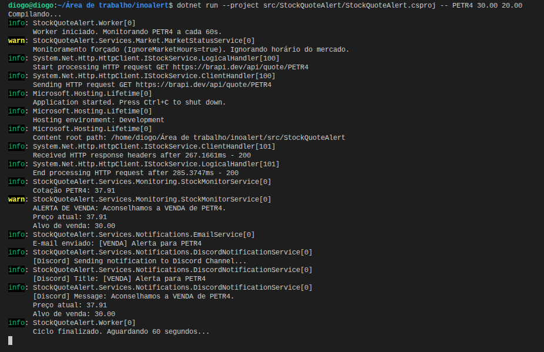
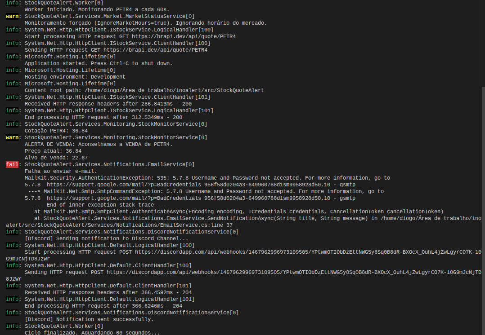
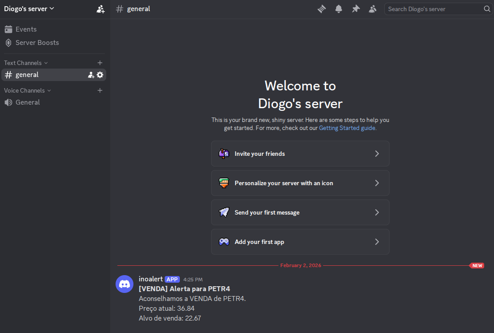
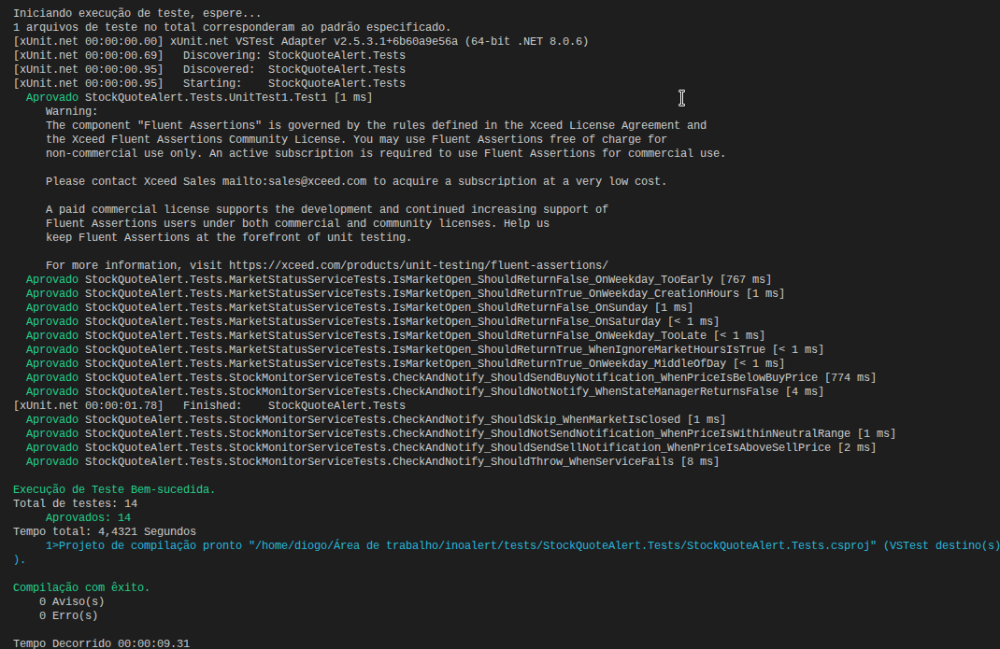
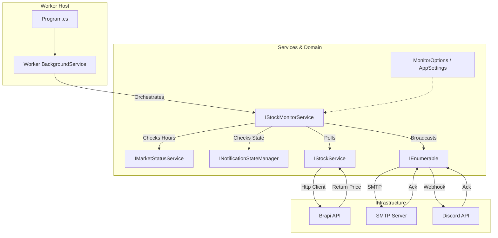

# inoalert

A robust, container-ready .NET Worker Service designed to monitor stock prices (B3) and send email alerts based on buy/sell thresholds.

## Table of Contents

1. [Overview](#overview)
2. [How to Run](#how-to-run)
    - [Prerequisites](#prerequisites)
    - [Configuration](#configuration)
    - [Locally (CLI)](#locally-cli)
    - [Using Docker](#using-docker)
3. [Execution Results & Demo](#execution-results--demo)
    - [Video Demo](#video-demo)
    - [1. Current Configuration](#1-current-configuration)
    - [2. CLI Execution Result](#2-cli-execution-result)
    - [3. Docker Container Execution](#3-docker-container-execution)
    - [4. Email Notification](#4-email-notification)
    - [5. Discord Notification](#5-discord-notification)
    - [6. Automated Tests](#6-automated-tests)
4. [Configuration Guide](#configuration-guide)
    - [1. Local (Developer Mode)](#1-local-developer-mode)
    - [2. Docker (Containerized)](#2-docker-containerized)
5. [Architecture](#architecture)
    - [High-Level Diagram](#high-level-diagram)
    - [Component Design](#component-design)
    - [Project Structure](#project-structure)
6. [Technology Stack](#technology-stack)
7. [Design Decisions & Trade-offs](#design-decisions--trade-offs)
    - [Why .NET Worker Service?](#why-net-worker-service)
    - [Why Monolith over Microservices?](#why-monolith-over-microservices)
    - [Scalability Strategy](#scalability-strategy)
8. [Design Patterns Used](#design-patterns-used)
9. [Resilience & Reliability](#resilience--reliability)
10. [Quality Assurance & Testing](#quality-assurance--testing)
    - [What is tested?](#what-is-tested)
    - [How to run tests](#how-to-run-tests)
11. [Docker Optimization and Best Practices](#docker-optimization-and-best-practices)
12. [Author](#author)
13. [Commit Pattern](#commit-pattern)

---

## Overview

This application acts as a personal financial assistant. It continuously polls a stock API (Brapi.dev) for a specific asset. If the price crosses a user-defined threshold (Drop below Buy Price or Rise above Sell Price), it dispatches an email notification via SMTP.

## How to Run

### Prerequisites

- .NET 8 SDK
- Docker (optional)
- An SMTP server (e.g., Gmail, SendGrid, or [Mailtrap](https://mailtrap.io) for testing)

### Configuration

> ⚠️ **SECURITY WARNING:** The `appsettings.json` file in this repository may contain example credentials for testing purposes. **NEVER** commit real production credentials (like your Gmail password or API Keys) to version control. For production environments, use **Environment Variables** or **.NET User Secrets** to securely override these settings without exposing them in the code.

Update `src/StockQuoteAlert/appsettings.json` with your credentials:

```json
{
  "Logging": { ... },
  "AppSettings": {
    // SMTP server configuration
    "Smtp": {
      "Host": "smtp.gmail.com",
      "Port": 587,
      "User": "your_email@gmail.com",
      "Password": "your_app_password"
    },
    // The recipient email address
    "NotifyEmail": "target_user@gmail.com",
    // Time in seconds between checks
    "MonitoringIntervalSeconds": 60,
    // (Optional) Brapi.dev API Token for higher rate limits
    "BrapiToken": "your_brapi_token",
    // (Testing) Set to true to bypass market status check
    "IgnoreMarketHours": false,
    // Active Notification Channels (Strategy Pattern)
    "EnabledChannels": [ "Email", "Discord" ],
    // Discord Webhook URL (Required if Discord channel is enabled)
    "DiscordWebhookUrl": "https://discordapp.com/api/webhooks/..."
  }
}
```

### Locally (CLI)

Pass the Asset Symbol, Sell Price, and Buy Price as arguments:

```bash
# Selling target: 22.67 | Buying target: 22.59
cd src/StockQuoteAlert
dotnet run -- PETR4 22.67 22.59
```

### Using Docker

Build the image using the provided multi-stage Dockerfile:

```bash
# From root directory
docker build -t stock-alert -f src/StockQuoteAlert/Dockerfile src/StockQuoteAlert
```

**Configuration (Environment Variables):**
When running in Docker, do NOT edit `appsettings.json`. Instead, pass environment variables to override the defaults.

```bash
# Run container with custom SMTP settings
docker run --name petr4-monitor \
  -e AppSettings__Smtp__Host=smtp.mailtrap.io \
  -e AppSettings__Smtp__User=my_user \
  -e AppSettings__Smtp__Password=my_password \
  stock-alert PETR4 22.67 22.59
```

## Execution Results & Demo

Based on the latest test runs, here is the state of the configuration and the results obtained.

### Video Demo

You can check a video recording of the execution here: [inoalert_record.mp4](docs/inoalert_record.mp4)

### 1. Current Configuration

The application is currently configured with the following `appsettings.json` for development/testing usage.

> **Functionality Note:** `IgnoreMarketHours` is set to `true` to allow testing outside of B3 trading hours (10:00 - 17:00).
> **App Password Note:** For Gmail SMTP, ensure you use an **App Password** if 2FA is enabled. Regular account passwords will not work. Google "App Password Gmail" for instructions.

```json
{
  "Logging": {
    "LogLevel": {
      "Default": "Information",
      "Microsoft.Hosting.Lifetime": "Information"
    }
  },
  "AppSettings": {
    "Smtp": {
      "Host": "smtp.gmail.com",
      "Port": 587,
      "User": "diogomartinsdassis@gmail.com",
      "Password": "your_app_password_here"
    },
    "NotifyEmail": "diogo.engx@gmail.com",
    "MonitoringIntervalSeconds": 60,
    "BrapiToken": "",
    "IgnoreMarketHours": true,
    "EnabledChannels": [
      "Email",
      "Discord"
    ]
  }
}
```

### 2. CLI Execution Result

Running the application locally with `dotnet run` produced the following output:

**Command:**

```bash
dotnet run --project src/StockQuoteAlert/StockQuoteAlert.csproj -- PETR4 30.00 20.00
```

**Outcome:**
The system correctly identified that **PETR4** (trading at **37.91**) was above the sell target (**30.00**). It triggered the "Sell Alert" via Email and Discord logs.



### 3. Docker Container Execution

To verify containerization, the image was pulled and run with environment variable overrides.

**Command:**

```bash
docker run --name inoalert-test -d \
-e AppSettings__IgnoreMarketHours=true \
-e AppSettings__Smtp__Host=smtp.gmail.com \
-e AppSettings__Smtp__Port=587 \
... (credentials) ...
ghcr.io/diogomassis/inoalert:latest \
PETR4 30.00 20.00
```

**Outcome:**
The Docker container started successfully, monitored the stock, and produced identical alert logs to the local version, confirming the environment independence.


### 4. Email Notification

The SMTP integration successfully delivered the alert to the inbox.

**Subject:** `[VENDA] Alerta para PETR4`  
**Body:**  
> Aconselhamos a VENDA de PETR4.  
> Preço atual: 37.91  
> Alvo de venda: 30.00


### 5. Discord Notification

The integration with Discord Webhooks allows receiving alerts directly in a configured channel.

**Outcome:**
The system successfully sends a POST request to the configured Discord Webhook.

**Video Demo:** [inoalert_discord_record.mp4](docs/inoalert_discord_record.mp4)





**Note:** There is an error during the e-mail sending process in the screenshot above because the password was intentionally omitted for security reasons. In a real scenario, ensure valid credentials are provided.

### 6. Automated Tests

The Unit Tests covering Services and Logic passed (14/14 tests).

**Command:** `dotnet test`




### Key Logic: Anti-Flood System

To avoid annoying the user (Email Flooding), the `NotificationStateManager` implements a throttling logic:

1. **Price Change Trigger:** If the stock price changes (e.g., from 37.91 to 37.92) while still in the alert zone, a **new** notification is sent immediately. This ensures the user has the most up-to-date accurate price.
2. **Same Price Cooldown:** If the price remains **exactly** the same in the next cycle (cached price match), the system **suppresses** the notification.
3. **Reminder Timeout:** If the price remains the same for more than **10 minutes**, the system forces a "Reminder" notification to ensure the user didn't miss the previous alert.

---

## Configuration Guide

Depending on your environment, you should configure the application differently:

| Environment | Where to Edit | Key Files |
| :--- | :--- | :--- |
| **Local (CLI)** | JSON Config | `src/StockQuoteAlert/appsettings.json` |
| **Docker** | Environment Vars | Pass `-e` flags in `docker run` command |

### 1. Local (Developer Mode)

Simply open `src/StockQuoteAlert/appsettings.json` and fill in your Mailtrap credentials.

### 2. Docker (Containerized)

Override the settings using environment variables. The structure uses double underscore `__` for nesting:

- JSON: `Smtp: { User: "abc" }`
- Env Var: `AppSettings__Smtp__User=abc`

---

## Architecture

The solution follows a **Clean Architecture** simplified approach suitable for a Worker Process. It separates the domain logic, infrastructure services, and the hosting entry point.

### High-Level Diagram



### Component Design

1. **Worker (Host):** The orchestration layer. It manages the lifecycle of the application and triggers the `StockMonitorService`.
2. **IStockMonitorService:** Encapsulates the core business logic (Comparing Price vs. Thresholds).
3. **IMarketStatusService:** Checks if the B3 Exchange is currently open (Weekdays 10:00 - 17:30 BRT), saving resources when the market is closed. Can be bypassed for testing via `IgnoreMarketHours` config.
4. **IStockService:** Abstracts the complexity of fetching data. It doesn't matter if the data comes from Brapi, Yahoo, or a database.
5. **INotificationStateManager:** Manages the state of sent notifications (in-memory) to prevent spamming. It tracks the last price and time to decide if a new alert is necessary.
6. **INotificationService:** The application supports multiple simultaneous notification channels (Strategy Pattern).
    - **Configurable:** Channels are dynamically registered based on `EnabledChannels` in `appsettings.json`.
    - **Extensible:** Includes a real `EmailService` and `DiscordNotificationService` (Webhook) to demonstrate how to easily plug in new providers (like Slack, SMS, WhatsApp) without modifying the core logic.

### Project Structure

The solution codebase is organized by domain responsibilities within `Services/`:

- **Market/**: Handles external data acquisition (`StockService`) and exchange validation (`MarketStatusService`).
- **Notifications/**: Manages alert channels (`EmailService`, `DiscordNotificationService`) and anti-spam state rules (`NotificationStateManager`).
- **Monitoring/**: Contains the core logic (`StockMonitorService`) that orchestrates the flow between data and alerts.

---

## Technology Stack

- **Language:** C# 12 / .NET 8
- **Execution Model:** `Microsoft.Extensions.Hosting` (Worker Service)
- **Networking:** `HttpClient` with `IHttpClientFactory`
- **Resilience:** `Microsoft.Extensions.Http.Polly`
- **Email:** `MailKit` & `MimeKit`
- **Containerization:** Docker (Alpine Linux based for small footprint)
- **CI:** GitHub Actions

---

## Design Decisions & Trade-offs

### Why .NET Worker Service?

Instead of a raw `Console.Application` with a `while(true)` loop, we used the **Worker Service** template.

- **Benefit:** Provides out-of-the-box support for Dependency Injection, Logging, Configuration (appsettings + env vars), and Graceful Shutdown (handling SIGTERM signals from Docker).
- **Trade-off:** Slightly more boilerplate code than a "Hello World" console app, but significantly more maintainable.

### Why Monolith over Microservices?

A simplified architecture was chosen over a distributed microservice architecture (e.g., RabbitMQ for queuing alerts, Redis for cache).

- **Reasoning:** The problem domain (monitoring a specific stock) is highly cohesive. Splitting the fetching logic and sending logic into different services would introduce **network latency**, **serialization costs**, and **operational complexity** without adding value.
- **The "Fallacy of Distributed Computing":** For a single-responsibility monitoring agent, keeping processing "In-Process" is the most performant and robust decision.

### Scalability Strategy

Even though it is a single service, it scales **Horizontally**.

- **Scenario:** You want to monitor 500 different stocks.
- **Solution:** You do not run one massive instance. You spawn 500 light containers, each configured with different arguments monitoring one stock.
  - `docker run stock-alert PETR4 ...`
  - `docker run stock-alert VALE3 ...`
- **Resource Usage:** Since we use Alpine Linux and .NET 8, the memory footprint is minimal (~60MB RAM).

---

## Design Patterns Used

1. **Dependency Injection (DI):**
    All dependencies (`IStockService`, `IEmailService`, `Configuration`) are injected. This makes the code testable (we can mock the API during tests) and loosely coupled.

2. **Options Pattern:**
    Used to bind `appsettings.json` sections to strongly typed classes (`AppSettings`), preventing "Magic Strings" for configuration keys.

3. **Strategy Pattern:**
    - **Data Fetching:** By using `IStockService`, we can easily swap the API provider (Brapi vs Yahoo) without changing business logic.
    - **Notifications:** We use `IEnumerable<INotificationService>` to execute multiple notification strategies (Email, Discord, Slack) simultaneously. This adheres to the **Open/Closed Principle**—we can add a new notification channel (e.g., SMS) by creating a new class without modifying the existing `StockMonitorService`.

4. **Retry Pattern (Polly):**
    Network requests are flaky. We implemented a **Exponential Backoff** policy. If the API fails, the application doesn't crash; it waits and retries intelligently.

5. **In-Memory State Management:**
    To solve the "Alert Spam" problem without introducing external dependencies (like Redis), we implemented a thread-safe `INotificationStateManager`. It enforces business rules (e.g., "Only notify again if price changes or 10 minutes pass") keeping the architecture cleaner and self-contained.

6. **Smart Resource Usage:**
    The application includes a `MarketStatusService` that prevents unnecessary API calls when the Stock Market (B3) is closed, such as weekends or outside trading hours (10:00 - 17:30).

---

## Resilience & Reliability

The application is designed to be "Crash Resistant":

- **Transient Fault Handling:** Using Polly, we handle HTTP 5xx errors and timeouts gracefully.
- **Graceful Error Handling:** If an email fails to send, the loop continues. We log the error but do not kill the process, ensuring that monitoring persists even if the SMTP server blips.
- **Containerization:** The Dockerfile uses `dotnet restore` and `dotnet publish` in separate stages to ensure a clean, optimized production image.

---

## Quality Assurance & Testing

This project adopts a **Test-Driven** mindset to ensure logic correctness and refactoring safety.

**Tools Used:**

- **xUnit:** The test runner.
- **Moq:** For mocking external dependencies (`IStockService`, `IEmailService`). Allows testing the business logic without making real HTTP requests or sending emails.
- **FluentAssertions:** For writing readable and expressive assertions.

### What is tested?

The critical business logic resides in `StockMonitorService` and is fully covered:

1. **Sell Logic:** Ensures an email is dispatched when `Price > SellPrice`.
2. **Buy Logic:** Ensures an email is dispatched when `Price < BuyPrice`.
3. **Neutral Logic:** Ensures NO email is sent when the price is within the acceptable range.
4. **Resilience:** Ensures the service handles API failures (throws) without crashing the Worker loop (which catches it).

### How to run tests

```bash
dotnet test
```

---

## Docker Optimization and Best Practices

To ensure the container is as fast, small, and secure as possible, we applied several advanced patterns. These techniques are based on industry standards and recommendations from experts.

**Source of Inspiration:** [Docker Performance & Optimization Guide (YouTube)](https://www.youtube.com/watch?v=t779DVjCKCs)

We implemented the following strategies from the guide:

1. **Base Images:**
    We switched from the standard `dotnet/runtime` (Ubuntu based) to `dotnet/runtime:8.0-alpine`. Alpine Linux is a security-oriented, lightweight Linux distribution (~5MB). This reduces the final image size from ~200MB to ~80MB.

2. **Distroless / Minimal Images:**
    By using Alpine, we strip away unnecessary tools (bash, curl, systemd) that are not needed for the app to run. This reduces the attack surface significantly.

3. **Layer Caching:**
    In the `Dockerfile`, we copy `*.csproj` and run `dotnet restore` **before** copying the rest of the source code.
    - *Result:* Docker caches the "Restore" layer. If you change a line of code in `Program.cs` but don't add a new NuGet package, Docker skips the slow `restore` step and only rebuilds the app code.

4. **DockerIgnore:**
    A `.dockerignore` file prevents `bin/`, `obj/`, `.git/` and local credentials from being sent to the Docker Daemon during build. This speeds up the "Building context" phase and prevents secrets leakage.

5. **Multi-Stage Builds:**
    We use two stages:
    - **Builder:** Contains the full .NET SDK (heavy) to compile the code.
    - **Runtime:** Contains only the minimal runtime (light).
    We discard the SDK layers and keep only the compiled DLLs in the final image.

6. **Security (User Permissions):**
    We create and switch to a non-root user (`appuser`) inside the container. This prevents a potential attacker from gaining root access to the host if they manage to break out of the application.

---

## Author

**Diogo Martins de Assis**  
[LinkedIn](https://www.linkedin.com/in/diogomassis)

---

## Commit Pattern

This project strictly follows the **[Conventional Commits](https://www.conventionalcommits.org/)** specification.

- **feat**: A new feature
- **fix**: A bug fix
- **docs**: Documentation only changes
- **style**: Changes that do not affect the meaning of the code (white-space, formatting, etc)
- **refactor**: A code change that neither fixes a bug nor adds a feature
- **perf**: A code change that improves performance
- **test**: Adding missing tests or correcting existing tests
- **chore**: Changes to the build process or auxiliary tools and libraries such as documentation generation
