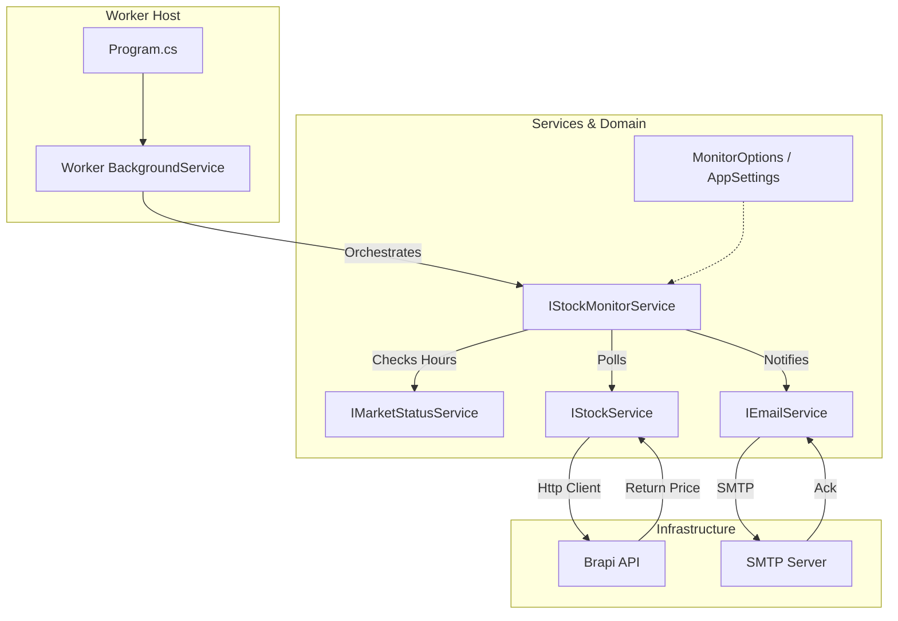

# StockQuoteAlert


A robust, container-ready .NET Worker Service designed to monitor stock prices (B3) and send email alerts based on buy/sell thresholds.

## Table of Contents

1. [Overview](#overview)
2. [How to Run](#how-to-run)
    - [Prerequisites](#prerequisites)
    - [Configuration](#configuration)
    - [Locally (CLI)](#locally-cli)
    - [Using Docker](#using-docker)
3. [Configuration Guide](#configuration-guide)
4. [Architecture](#architecture)
    - [High-Level Diagram](#high-level-diagram)
    - [Component Design](#component-design)
5. [Technology Stack](#technology-stack)
6. [Design Decisions & Trade-offs](#design-decisions--trade-offs)
    - [Why .NET Worker Service?](#why-net-worker-service)
    - [Why Monolith over Microservices?](#why-monolith-over-microservices)
    - [Scalability Strategy](#scalability-strategy)
7. [Design Patterns Used](#design-patterns-used)
8. [Resilience & Reliability](#resilience--reliability)
9. [Quality Assurance & Testing](#quality-assurance--testing)
10. [Docker Optimization & Best Practices](#docker-optimization--best-practices)
11. [Interest in Kubernetes?](#interest-in-kubernetes)
12. [Author](#author)

---

## Overview

This application acts as a personal financial assistant. It continuously polls a stock API (Brapi.dev) for a specific asset. If the price crosses a user-defined threshold (Drop below Buy Price or Rise above Sell Price), it dispatches an email notification via SMTP.

## How to Run

### Prerequisites

- .NET 8 SDK
- Docker (optional)
- An SMTP server (e.g., Gmail, SendGrid, or [Mailtrap](https://mailtrap.io) for testing)

### Configuration

> ⚠️ **SECURITY WARNING:** The `appsettings.json` file in this repository may contain example credentials for testing purposes. **NEVER** commit real production credentials (like your Gmail password or API Keys) to version control. For production environments, use **Environment Variables** or **.NET User Secrets** to securely override these settings without exposing them in the code.

Update `src/StockQuoteAlert/appsettings.json` with your SMTP credentials:

```json
"Smtp": {
  "Host": "smtp.mailtrap.io",
  "Port": 587,
  "User": "your_user",
  "Password": "your_password"
}
```

### Locally (CLI)

Pass the Asset Symbol, Sell Price, and Buy Price as arguments:

```bash
# Selling target: 22.67 | Buying target: 22.59
cd src/StockQuoteAlert
dotnet run -- PETR4 22.67 22.59
```

### Using Docker

Build the image using the provided multi-stage Dockerfile:

```bash
# From root directory
docker build -t stock-alert -f src/StockQuoteAlert/Dockerfile src/StockQuoteAlert
```

**Configuration (Environment Variables):**
When running in Docker, do NOT edit `appsettings.json`. Instead, pass environment variables to override the defaults.

```bash
# Run container with custom SMTP settings
docker run --name petr4-monitor \
  -e AppSettings__Smtp__Host=smtp.mailtrap.io \
  -e AppSettings__Smtp__User=my_user \
  -e AppSettings__Smtp__Password=my_password \
  stock-alert PETR4 22.67 22.59
```

## Configuration Guide

Depending on your environment, you should configure the application differently:

| Environment | Where to Edit | Key Files |
| :--- | :--- | :--- |
| **Local (CLI)** | JSON Config | `src/StockQuoteAlert/appsettings.json` |
| **Docker** | Environment Vars | Pass `-e` flags in `docker run` command |

### 1. Local (Developer Mode)

Simply open `src/StockQuoteAlert/appsettings.json` and fill in your Mailtrap credentials.

### 2. Docker (Containerized)

Override the settings using environment variables. The structure uses double underscore `__` for nesting:

- JSON: `Smtp: { User: "abc" }`
- Env Var: `AppSettings__Smtp__User=abc`

---

## Architecture

The solution follows a **Clean Architecture** simplified approach suitable for a Worker Process. It separates the domain logic, infrastructure services, and the hosting entry point.

### High-Level Diagram



### Component Design

1. **Worker (Host):** The orchestration layer. It manages the lifecycle of the application and triggers the `StockMonitorService`.
2. **IStockMonitorService:** Encapsulates the core business logic (Comparing Price vs. Thresholds).
3. **IMarketStatusService:** Checks if the B3 Exchange is currently open (Weekdays 10:00 - 17:30 BRT), saving resources when the market is closed.
4. **IStockService:** Abstracts the complexity of fetching data. It doesn't matter if the data comes from Brapi, Yahoo, or a database.
5. **IEmailService:** Abstracts the notification method.

---

## Technology Stack

- **Language:** C# 12 / .NET 8
- **Execution Model:** `Microsoft.Extensions.Hosting` (Worker Service)
- **Networking:** `HttpClient` with `IHttpClientFactory`
- **Resilience:** `Microsoft.Extensions.Http.Polly`
- **Email:** `MailKit` & `MimeKit`
- **Containerization:** Docker (Alpine Linux based for small footprint)
- **CI:** GitHub Actions

---

## Design Decisions & Trade-offs

### Why .NET Worker Service?

Instead of a raw `Console.Application` with a `while(true)` loop, we used the **Worker Service** template.

- **Benefit:** Provides out-of-the-box support for Dependency Injection, Logging, Configuration (appsettings + env vars), and Graceful Shutdown (handling SIGTERM signals from Docker).
- **Trade-off:** Slightly more boilerplate code than a "Hello World" console app, but significantly more maintainable.

### Why Monolith over Microservices?

A simplified architecture was chosen over a distributed microservice architecture (e.g., RabbitMQ for queuing alerts, Redis for cache).

- **Reasoning:** The problem domain (monitoring a specific stock) is highly cohesive. Splitting the fetching logic and sending logic into different services would introduce **network latency**, **serialization costs**, and **operational complexity** without adding value.
- **The "Fallacy of Distributed Computing":** For a single-responsibility monitoring agent, keeping processing "In-Process" is the most performant and robust decision.

### Scalability Strategy

Even though it is a single service, it scales **Horizontally**.

- **Scenario:** You want to monitor 500 different stocks.
- **Solution:** You do not run one massive instance. You spawn 500 light containers, each configured with different arguments monitoring one stock.
  - `docker run stock-alert PETR4 ...`
  - `docker run stock-alert VALE3 ...`
- **Resource Usage:** Since we use Alpine Linux and .NET 8, the memory footprint is minimal (~60MB RAM).

---

## Design Patterns Used

1. **Dependency Injection (DI):**
    All dependencies (`IStockService`, `IEmailService`, `Configuration`) are injected. This makes the code testable (we can mock the API during tests) and loosely coupled.

2. **Options Pattern:**
    Used to bind `appsettings.json` sections to strongly typed classes (`AppSettings`), preventing "Magic Strings" for configuration keys.

3. **Strategy Pattern (implied via Interfaces):**
    By using `IStockService`, we can easily swap the implementation. If Brapi.dev goes down, we can write a `YahooFinanceService : IStockService` and swap it in `Program.cs` without changing a single line of the `Worker` logic.

4. **Retry Pattern (Polly):**
    Network requests are flaky. We implemented a **Exponential Backoff** policy. If the API fails, the application doesn't crash; it waits and retries intelligently.

5. **Smart Resource Usage:**
    The application includes a `MarketStatusService` that prevents unnecessary API calls when the Stock Market (B3) is closed, such as weekends or outside trading hours (10:00 - 17:30).

---

## Resilience & Reliability

The application is designed to be "Crash Resistant":

- **Transient Fault Handling:** Using Polly, we handle HTTP 5xx errors and timeouts gracefully.
- **Graceful Error Handling:** If an email fails to send, the loop continues. We log the error but do not kill the process, ensuring that monitoring persists even if the SMTP server blips.
- **Containerization:** The Dockerfile uses `dotnet restore` and `dotnet publish` in separate stages to ensure a clean, optimized production image.

---

## Quality Assurance & Testing

This project adopts a **Test-Driven** mindset to ensure logic correctness and refactoring safety.

**Tools Used:**

- **xUnit:** The test runner.
- **Moq:** For mocking external dependencies (`IStockService`, `IEmailService`). Allows testing the business logic without making real HTTP requests or sending emails.
- **FluentAssertions:** For writing readable and expressive assertions.

### What is tested?

The critical business logic resides in `StockMonitorService` and is fully covered:

1. **Sell Logic:** Ensures an email is dispatched when `Price > SellPrice`.
2. **Buy Logic:** Ensures an email is dispatched when `Price < BuyPrice`.
3. **Neutral Logic:** Ensures NO email is sent when the price is within the acceptable range.
4. **Resilience:** Ensures the service handles API failures (throws) without crashing the Worker loop (which catches it).

### How to run tests

```bash
dotnet test
```

### Mutation Testing (Stryker)

To ensure our tests are not just "touching lines" but actually asserting logic, we use **Mutation Testing**.

> "Coverage only tells you what code was executed. Mutation testing tells you how satisfied your tests are."

**How it works:** Stryker introduces small bugs (mutants) into the compiled code (e.g., changing `>` to `>=` or removing a function call) and runs the tests. If the tests fail, the mutant is **Killed** (Good). If they pass, the mutant **Survived** (Bad, needs more strict tests).

**Run mutation tests:**

```bash
# Prepare environment (restore tool)
cd tests
dotnet tool restore

# Run Stryker from the test project
cd StockQuoteAlert.Tests
dotnet dotnet-stryker
```

Check the generated HTML report in `tests/StockQuoteAlert.Tests/StrykerOutput` for a visual inspection of code quality.

---

## Docker Optimization & Best Practices

To ensure the container is as fast, small, and secure as possible, we applied several advanced patterns. These techniques are based on industry standards and recommendations from experts.

**Source of Inspiration:** [Docker Performance & Optimization Guide (YouTube)](https://www.youtube.com/watch?v=t779DVjCKCs)

We implemented the following strategies from the guide:

1. **Base Images (0:34):**
    We switched from the standard `dotnet/runtime` (Ubuntu based) to `dotnet/runtime:8.0-alpine`. Alpine Linux is a security-oriented, lightweight Linux distribution (~5MB). This reduces the final image size from ~200MB to ~80MB.

2. **Distroless / Minimal Images (1:41):**
    By using Alpine, we strip away unnecessary tools (bash, curl, systemd) that are not needed for the app to run. This reduces the attack surface significantly.

3. **Layer Caching (2:14):**
    In the `Dockerfile`, we copy `*.csproj` and run `dotnet restore` **before** copying the rest of the source code.
    - *Result:* Docker caches the "Restore" layer. If you change a line of code in `Program.cs` but don't add a new NuGet package, Docker skips the slow `restore` step and only rebuilds the app code.

4. **DockerIgnore (3:15):**
    A `.dockerignore` file prevents `bin/`, `obj/`, `.git/` and local credentials from being sent to the Docker Daemon during build. This speeds up the "Building context" phase and prevents secrets leakage.

5. **Multi-Stage Builds (5:47):**
    We use two stages:
    - **Builder:** Contains the full .NET SDK (heavy) to compile the code.
    - **Runtime:** Contains only the minimal runtime (light).
    We discard the SDK layers and keep only the compiled DLLs in the final image.

6. **Security (User Permissions):**
    We create and switch to a non-root user (`appuser`) inside the container. This prevents a potential attacker from gaining root access to the host if they manage to break out of the application.

---

## Interest in Kubernetes?

This project focuses on single-instance Docker execution for **practicality and simplicity**. However, the application is container-ready and can be easily orchestrated.

If you are looking for a **Production-Ready Kubernetes** template (including HPA, Ingress, and Monitoring), you can easily adapt the infrastructure from my other project:

👉 **[url-shortener project](https://github.com/diogomassis/url-shortener)**

That repository contains a complete reference implementation (`deployment.yaml`, `secrets.yaml`, `k3d`, etc.) that corresponds perfectly to the needs of this worker service.

---

## Author

**Diogo Martins de Assis**  
[LinkedIn](https://www.linkedin.com/in/diogomassis)
