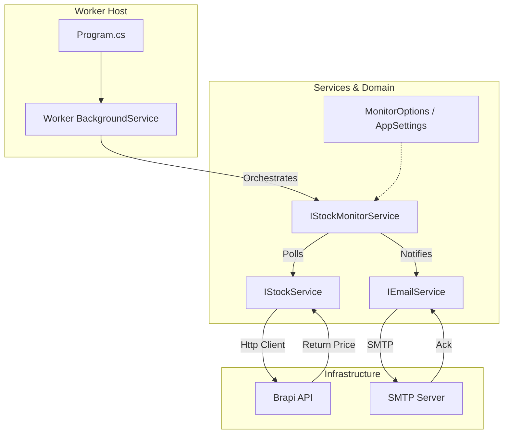

# StockQuoteAlert


A robust, container-ready .NET Worker Service designed to monitor stock prices (B3) and send email alerts based on buy/sell thresholds.

## Table of Contents

1. [Overview](#overview)
2. [How to Run](#how-to-run)
    - [Prerequisites](#prerequisites)
    - [Configuration](#configuration)
    - [Locally (CLI)](#locally-cli)
    - [Using Docker](#using-docker)
3. [Configuration Guide](#configuration-guide)
4. [Architecture](#architecture)
    - [High-Level Diagram](#high-level-diagram)
    - [Component Design](#component-design)
5. [Technology Stack](#technology-stack)
6. [Design Decisions & Trade-offs](#design-decisions--trade-offs)
    - [Why .NET Worker Service?](#why-net-worker-service)
    - [Why Monolith over Microservices?](#why-monolith-over-microservices)
    - [Scalability Strategy](#scalability-strategy)

---

## Overview

This application acts as a personal financial assistant. It continuously polls a stock API (Brapi.dev) for a specific asset. If the price crosses a user-defined threshold (Drop below Buy Price or Rise above Sell Price), it dispatches an email notification via SMTP.

## How to Run

### Prerequisites

- .NET 8 SDK
- Docker (optional)
- An SMTP server (e.g., Gmail, SendGrid, or [Mailtrap](https://mailtrap.io) for testing)

### Configuration

> ⚠️ **SECURITY WARNING:** The `appsettings.json` file in this repository may contain example credentials for testing purposes. **NEVER** commit real production credentials (like your Gmail password or API Keys) to version control. For production environments, use **Environment Variables** or **.NET User Secrets** to securely override these settings without exposing them in the code.

Update `src/StockQuoteAlert/appsettings.json` with your SMTP credentials:

```json
"Smtp": {
  "Host": "smtp.mailtrap.io",
  "Port": 587,
  "User": "your_user",
  "Password": "your_password"
}
```

### Locally (CLI)

Pass the Asset Symbol, Sell Price, and Buy Price as arguments:

```bash
# Selling target: 22.67 | Buying target: 22.59
cd src/StockQuoteAlert
dotnet run -- PETR4 22.67 22.59
```

### Using Docker

Build the image using the provided multi-stage Dockerfile:

```bash
# From root directory
docker build -t stock-alert -f src/StockQuoteAlert/Dockerfile src/StockQuoteAlert
```

**Configuration (Environment Variables):**
When running in Docker, do NOT edit `appsettings.json`. Instead, pass environment variables to override the defaults.

```bash
# Run container with custom SMTP settings
docker run --name petr4-monitor \
  -e AppSettings__Smtp__Host=smtp.mailtrap.io \
  -e AppSettings__Smtp__User=my_user \
  -e AppSettings__Smtp__Password=my_password \
  stock-alert PETR4 22.67 22.59
```

## Configuration Guide

Depending on your environment, you should configure the application differently:

| Environment | Where to Edit | Key Files |
| :--- | :--- | :--- |
| **Local (CLI)** | JSON Config | `src/StockQuoteAlert/appsettings.json` |
| **Docker** | Environment Vars | Pass `-e` flags in `docker run` command |

### 1. Local (Developer Mode)

Simply open `src/StockQuoteAlert/appsettings.json` and fill in your Mailtrap credentials.

### 2. Docker (Containerized)

Override the settings using environment variables. The structure uses double underscore `__` for nesting:

- JSON: `Smtp: { User: "abc" }`
- Env Var: `AppSettings__Smtp__User=abc`

---

## Architecture

The solution follows a **Clean Architecture** simplified approach suitable for a Worker Process. It separates the domain logic, infrastructure services, and the hosting entry point.

### High-Level Diagram



### Component Design

1. **Worker (Host):** The orchestration layer. It manages the lifecycle of the application and triggers the `StockMonitorService`.
2. **IStockMonitorService:** Encapsulates the core business logic (Comparing Price vs. Thresholds).
3. **IStockService:** Abstracts the complexity of fetching data. It doesn't matter if the data comes from Brapi, Yahoo, or a database.
4. **IEmailService:** Abstracts the notification method.

---

## Technology Stack

- **Language:** C# 12 / .NET 8
- **Execution Model:** `Microsoft.Extensions.Hosting` (Worker Service)
- **Networking:** `HttpClient` with `IHttpClientFactory`
- **Resilience:** `Microsoft.Extensions.Http.Polly`
- **Email:** `MailKit` & `MimeKit`
- **Containerization:** Docker (Alpine Linux based for small footprint)
- **CI:** GitHub Actions

---

## Design Decisions & Trade-offs

### Why .NET Worker Service?

Instead of a raw `Console.Application` with a `while(true)` loop, we used the **Worker Service** template.

- **Benefit:** Provides out-of-the-box support for Dependency Injection, Logging, Configuration (appsettings + env vars), and Graceful Shutdown (handling SIGTERM signals from Docker).
- **Trade-off:** Slightly more boilerplate code than a "Hello World" console app, but significantly more maintainable.

### Why Monolith over Microservices?

A simplified architecture was chosen over a distributed microservice architecture (e.g., RabbitMQ for queuing alerts, Redis for cache).

- **Reasoning:** The problem domain (monitoring a specific stock) is highly cohesive. Splitting the fetching logic and sending logic into different services would introduce **network latency**, **serialization costs**, and **operational complexity** without adding value.
- **The "Fallacy of Distributed Computing":** For a single-responsibility monitoring agent, keeping processing "In-Process" is the most performant and robust decision.

### Scalability Strategy

Even though it is a single service, it scales **Horizontally**.

- **Scenario:** You want to monitor 500 different stocks.
- **Solution:** You do not run one massive instance. You spawn 500 light containers, each configured with different arguments monitoring one stock.
  - `docker run stock-alert PETR4 ...`
  - `docker run stock-alert VALE3 ...`
- **Resource Usage:** Since we use Alpine Linux and .NET 8, the memory footprint is minimal (~60MB RAM).

---
